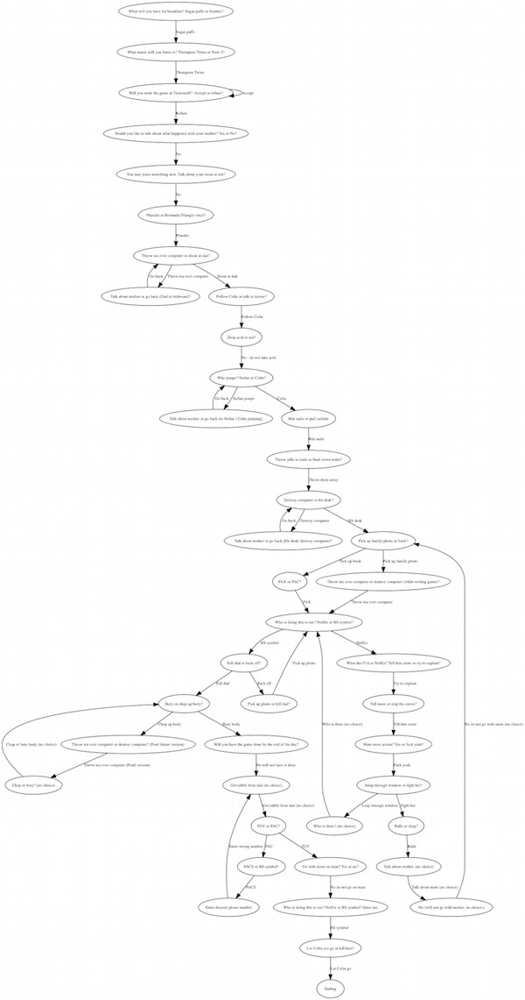

# BandersnatchGraphQL
A GraphQL API of the Black Mirror Netflix interactive film Bandersnatch.


To run the server:
```
bundle exec puma
```

http://localhost:9292/graphql
Request body example:
```
{ "query": "{ decisionPoints { id choices { name endingDecisionPoint { description } } } }" }
```
A visualization (if you want to go down the hole):



